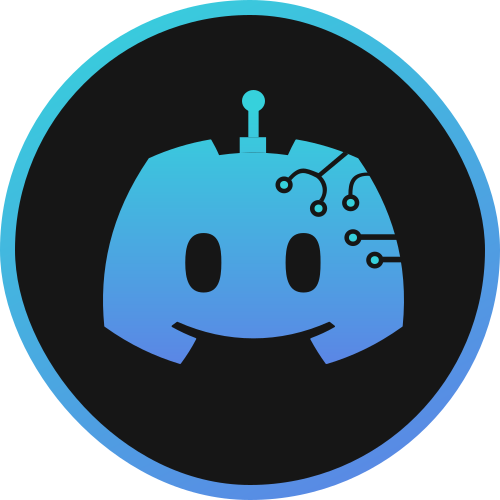

<p align="center">
    
</p>

<h1 align="center">DiscordGPT</h1>

<div align="center">

   

</div>

Discord GPT is a useful bot powered by <a>OpenAI's GPT-3.5</a> for Discord, with natural language processing capabilities and advanced conversational AI. Built with <a href="https://github.com/discordjs/discord.js" >Discord.js</a> and easy to use for developers and users alike.

- [User Guide](#👤-user-guide)
- [Developer Guide](#developer-guide)
- [Limitations of usage](#limitations-of-usage)
- [Contributions](#contributing)

## 👤 User guide

### Inviting the bot to the server

To invite DiscordGPT to your Discord server, follow these steps:

1. Invite DiscordGPT to your server [here]().
2. Select the server you want to invite the bot to from the dropdown list. 

    ⚠️ Make sure your user has the permissions to invite on the server.

3. Click "Authorize".

### 🔓 Required permissions

The bot needs the following permissions to function properly:

- Read messages
- Send messages
- Attach files

Make sure to grant it these permissions when inviting the bot to your server.

### 🤖 Using DiscordGPT

To use the bot, simply mention the bot with @D-GPT followed by the prompt you want to use. For example, to generate text from the prompt "Hello, how are you?", type the following in a text channel on your server:

````
@D-GPT Hello, how are you?
````

The bot will respond with text generated by GPT-3 based on the prompt you provided.

## Developer guide

### 🛠 Installing the project

To install and set up DiscordGPT on your own machine, follow these steps:

Clone the repository:

````bash
git clone https://github.com/alexdeploy/discord-gpt.git
````

Navigate to project directory

````bash
cd discord-gpt/client
````

Install the dependencies:

````bash
npm install
````

### 🔒 Configuring tokens

The bot needs the following tokens to function properly:

- A Discord token to authenticate the bot on your Discord server. You can generate a Discord token on the settings page of your application in the Discord Developer Console.

- An OpenAI token to authenticate requests to the GPT-3 model. You can get an OpenAI token on the settings page of your account on the OpenAI homepage.

Rename the `.env.example` file in the /client directory just to `.env` and set your tokens inside:

````
BOT_TOKEN="DISCORD_BOT_TOKEN_HERE"
CLIENT_ID="BOT_ID"
OPENAI_KEY="OPENAI_TOKEN_HERE"
````

Replace the values inside "" with Discord and OpenAI tokens you have generated. These tokens will be used for identify your bot and developer accounts.

👉 How to generate Bot token.

👉 How to generate OpenAI API Key.

👉 How to get the Client ID.


### 🚀 Starting the bot

To start the bot, run the following command from the `discord-gpt/client` directory of the project:

````bash
npm start
````

or development mode (auto-reload):

````bash
npm run dev
````

The bot will automatically connect to Discord and be ready for use.

## Limitations of usage.

Soon...

## Contributing 

Soon...

